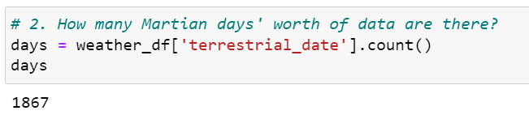

# MarsWeatherData
## Overview
Perform web-scraping and data analysis on data from the Mars NASA news site. Extract information via both automated browsing with Splinter and HTML parsing with Beautiful Soup. Assemble the scraped data into a Pandas DataFrame and analyze the dataset by using Pandas functions.
### Months in Mars
There are <b>12 months</b> in Mars.

### Martian Days
There are <b>1867 days</b> of data.

### Temperatures in Mars
The coldest month is the <b>third</b> month with an average temperature of <b>-83.31</b> degrees Celsius.
The warmest month is the <b>eight</b> month with an average temperature of <b>-68.38</b> degrees Celsius.

### Atmospheric Pressure in Mars
The month with the highest atmospheric pressure is the <b>ninth</b> month with an average pressure of 913.31.
The month with the lowest atmospheric pressure is the <b>sixth</b> month with an average pressure of 745.05.

### Terrestrial Days
The distance from peak to peak is roughly 1425-750, or 675 days. A year on Mars appears to be about 675 days from the plot. Internet search confirms that a Mars year is equivalent to <b>687</b> earth days.

